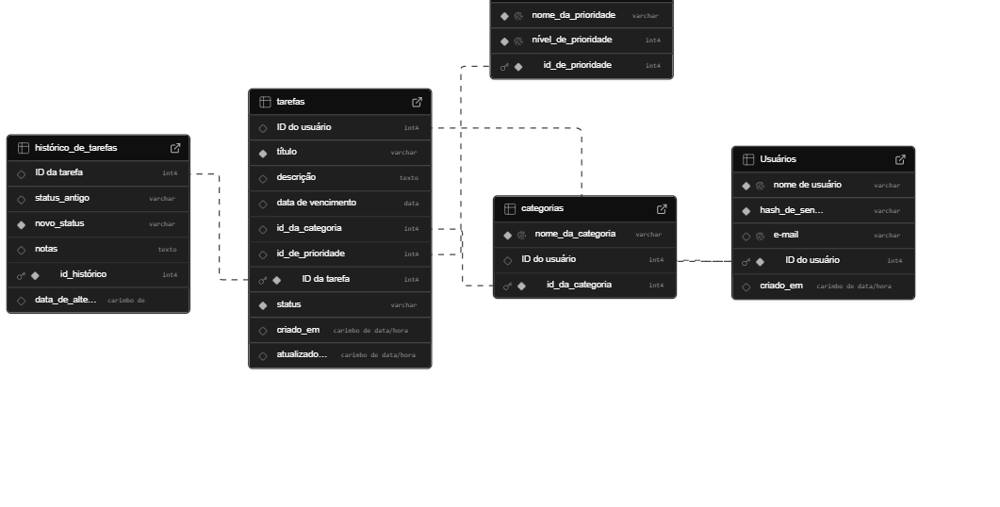

# 📌 Sistema de Gerenciamento de Tarefas Pessoais

Este projeto é uma aplicação web desenvolvida como parte do **Trabalho 02** da disciplina de **Banco de Dados II (2025.1)** do **Instituto Federal, Campus Picos**.  

O objetivo é criar um sistema funcional de gerenciamento de tarefas que demonstre o uso de conceitos avançados de banco de dados, como **Procedures, Functions e Triggers**, além de operações básicas de manipulação de dados.

---

## ✅ Requisitos do Projeto

A aplicação foi projetada para atender aos requisitos mínimos da disciplina:

- **Operações CRUD**: Criar, ler, atualizar e excluir tarefas.  
- **Recursos do PostgreSQL**: Procedures, Functions e Triggers.  
- **Comandos SQL**: `JOIN`, `GROUP BY` e funções de agregação (`COUNT()`, `SUM()`, `AVG()`).  
- **Submissão**: Código + script do banco de dados devem ser compartilhados via repositório no e-mail do professor.  

---

## ⚙️ Funcionalidades da Aplicação

- **Gestão de Tarefas**: Criar novas tarefas e visualizar todas as existentes.  
- **Organização**: Gerenciamento de categorias e prioridades.  
- **Atualização e Exclusão**: Edição e exclusão de tarefas.  
- **Relatórios e Estatísticas**: Resumo com número de tarefas por status e categoria (uso de `GROUP BY`).  
- **Automação (Triggers)**:  
  - Atualização automática da data de modificação.  
  - Registro de histórico de status em `task_history`.  

---

## 🛠 Tecnologias Utilizadas

- **Frontend**: HTML, CSS, JavaScript  
- **Backend**: Node.js (Express.js)  
- **Banco de Dados**: PostgreSQL (hospedado no [Supabase](https://supabase.com/))  

---

## 🗄 Estrutura do Banco de Dados

O banco de dados é composto por 5 tabelas interligadas:



- **users** → informações dos usuários  
- **priorities** → prioridades das tarefas  
- **categories** → categorias das tarefas  
- **tasks** → tarefas principais (FK para `users`, `priorities`, `categories`)  
- **task_history** → auditoria do histórico de status  

---

## 🚀 Como Rodar a Aplicação

### 🔧 Pré-requisitos
- [Node.js (LTS)](https://nodejs.org/) + npm  
- [Git](https://git-scm.com/)  
- [Supabase CLI](https://supabase.com/docs/guides/cli) + Docker (opcional, para ambiente local)  

---

### 📥 Passos de Instalação

1. **Clone o repositório**  
   ```bash
   git clone https://github.com/Kaiomourato/GerenciadorDeTarefasPessoais.git
   cd GERENCIADOR DE TAREFAS PESSOAIS
2. **Instale as dependências**
    npm install
### ⚠️ Algumas redes (ex.: IFPI) podem bloquear conexões externas.

### 🚀 EXECUTANDO DA APLICAÇÃO
- Inicie o servidor: node app.js
- Abra o navegador: http://localhost:3000